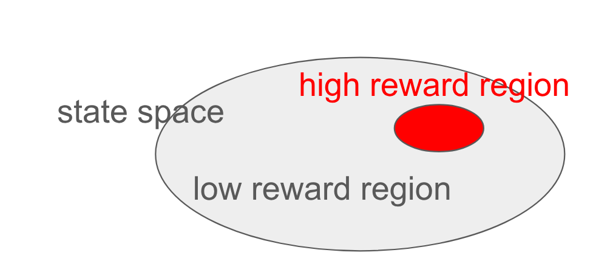

# 🚀 Forward Backward Model

> **📊 Accompanying Slides**: [Google Presentation](https://docs.google.com/presentation/d/1XfeRfmwQubKxpkz8C4dJugiHtlKoMb55R8ZWK5_LkSE)

## 📖 Overview

This tutorial introduces an **Unsupervised Reinforcement Learning Algorithm** called the Forward Backward Model through the lens of multi-task policy iteration. The key insight is that the **occupancy measure** makes it possible to **decouple dynamics learning and value learning**, enabling, thus we can build a policy iteration that can optimize for a family of rewards at the same time. By factorizing occupancy measure with the **forward backward representation**, FB model further enables the **automatic construction of the family of rewards** and their corresponding optimal policies simultaneously.

Apart from the elegant math formulation, the training of FB model can also be intuitively understood as a **latent space goal conditioned reinforcement learning** framework, where the latent space is automatically constructed with dynamics prediction as the self-supervision signal and the zero-shot reward inference process can be understood as a reward weighted **latent space goal retrieval** process.

### 📋 Scope & Limitations

> **Note**: This tutorial focuses on the Forward Backward model formulation from a fresh perspective, emphasizing intuition and algorithmic understanding. It does **not** cover:
> - Optimization processes and convergence analysis
> - Specific optimization algorithms (PPO, SAC, etc.)

<!-- ### 📚 Related Work

- **Meta Motivo**
- **HILP**  -->

## 🧮 Occupancy Measure and Q Function

Before diving into the Forward Backward model, let's establish the mathematical foundations with clear definitions of occupancy measures and Q functions.

### Q Function

**Definition**: The Q function represents the expected discounted future reward:

$$Q^{\pi}(s,a) = E_{\tau \sim \pi}[\gamma^t \cdot r(s_t)]$$

where $\tau$ follows the trajectory of the MDP under policy $\pi$.

**Bellman Equation**: The recursive relationship for Q functions:

$$Q^{\pi}(s,a) = r(s,a) + \gamma \cdot E_{s', a'}[Q^{\pi}(s',a')]$$

The expectation is taken over:
- Next state: $s' \sim P(s'|s,a)$ 
- Next action: $a' \sim \pi(a'|s')$

> **💡 Key Point**: A Q function is defined by **an MDP with reward and a policy**. It captures the discounted future reward starting from state-action pair $(s,a)$ and following policy $\pi$.

### Occupancy Measure

**Definition**: The occupancy measure captures the expected discounted future state visitation probability:

$$M^{\pi}(s^+ | s, a) = E_{\tau \sim \pi}[\sum_t \gamma^t \cdot P(s_t = s^+)]$$

**Bellman Equation**: The recursive relationship for occupancy measures:

$$M^{\pi}(s^+ | s, a) = p(s^+ | s, a) + \gamma \cdot E_{s', a'}[M^{\pi}(s^+ | s', a')]$$

here $M^{\pi}(s^+ | s, a)$ represents the probability density function version of the occupancy measure.

> **💡 Key Point**: An occupancy measure is defined by **a reward-free MDP and a policy**. It captures the discounted future state distribution starting from state-action pair $(s,a)$ and following policy $\pi$.

#### 🔗 Relationship Between Q Function and Occupancy Measure

The elegant connection between these concepts emerges when we consider arbitrary reward functions. Although the occupancy measure is defined for reward-free MDPs, we can use it to evaluate Q functions for any reward function $r(s^+)$:

$$Q^{\pi}(s,a) = \int_{s^+} M^{\pi}(s^+ | s, a) \cdot r(s^+)$$

**Intuition**: Since the occupancy measure represents the expected discounted future state distribution, we can evaluate the Q function by integrating over all possible future states, weighted by their respective rewards.

> **🎓 Mathematical Insight: Deriving the Occupancy Measure Bellman Equation**
> 
> Starting with the Q function Bellman equation and substituting the occupancy measure relationship:
> 
> $$\int_{s^+} M^{\pi}(s^+ | s, a) \cdot r(s^+) = \int_{s^+} p(s^+ | s, a) r(s^+) + \gamma \cdot E_{s', a'}\left[ \int_{s^+} M^{\pi}(s^+ | s', a') \cdot r(s^+) \right]$$
>
> Since this equation must hold for **all possible reward functions** $r(s^+)$, we can factor out the reward term (mathematically, this can be proven using the properties of delta functions):
>
> $$M^{\pi}(s^+ | s, a) = p(s^+ | s, a) + \gamma \cdot E_{s', a'}\left[ M^{\pi}(s^+ | s', a') \right]$$

## 🔄 From Q-Learning to Multi-Task Policy Iteration

This section bridges classical reinforcement learning algorithms with our multi-task framework by progressively introducing the occupancy measure perspective.

### Q-Learning

**Core Update Rule**: Q-learning performs Bellman updates in the following form:

$$Q(s,a) \leftarrow r(s) + \gamma \max_{a'} \mathbb{E}_{s' \sim P(s'|s,a)}[Q(s',a')]$$

**Policy Extraction**: In discrete action spaces, the Q function directly represents the optimal policy:

$$\pi(s) = \argmax_{a} Q(s,a)$$

### DDPG (Deep Deterministic Policy Gradient)

In continuous action spaces, we cannot take that argmax, we need to have a policy to propose the action. If we think of argmax as a rule based selection, using a policy to propose the action is a neural approximation of the same operation.

So the algorithm splits to two steps, one evaluating the current policy and one optimizing the policy.

**Two-Step Process**:
1. **Policy Evaluation**: 
   $$Q(s,a) \leftarrow r(s) + \gamma \mathbb{E}_{a' \sim \pi(a'|s')} \mathbb{E}_{s' \sim P(s'|s,a)}[Q(s',a')]$$

2. **Policy Improvement**: 
    <!-- $$\pi(s) \leftarrow \argmax_{a} Q(s,a)$$ -->
   $$\mathcal{L}(\pi) = - \mathbb{E}_{s}[Q(s,a)]$$

We abuse math notation and use the following notation to denote the policy improvement step:
$$\pi(s) \leftarrow \argmax_{a} Q(s,a)$$

### DDPG with Occupancy Measure

Now we can rewrite the above DDPG with occupancy measure:

1. **Dynamics Learning** (Reward-Free):
   $$M^\pi(s^+ | s, a) \leftarrow p(s^+ | s, a) + \gamma \mathbb{E}_{s', a'}\left[ M^\pi(s^+ | s', a') \right]$$

2. **Policy Improvement** (Reward-Dependent):
   $$\pi(s) \leftarrow \argmax_{a} \int_{s^+} M^\pi(s^+ | s, a) \cdot r(s^+)$$

The first equation is the bellman equation for occupancy measure, it captures the policy related transition dynamics of a reward-free MDP. The second equation takes reward into account and optimizes the policy by maximizing the expected discounted future state visitation weighted by the reward it will receive at those future states.

What does this new interpretation from occupancy measure perspective give us?

#### 🌟 Advantages of This Reformulation

1. **Dynamics Factorization**: The first equation provides a way to summarize the transition dynamics of the MDP without considering rewards. This factorization allows us to learn the transition dynamics of the MDP in a reward-agnostic way, but we can still evaluate the Q function by integrating over all possible future states and weighting them by the reward function.
2. **Multi-Task Potential**: Only the second equation is related to the reward, we can plug in multiple reward functions $\{r_i\}$ to the second equation and optimize for the optimal policies for each reward function simultaneously, because the learned dynamics summary can be reused across different reward functions

### Multi-Task Policy Iteration Framework

**Goal**: Given a family of reward functions $\{r(s^+)\}$, learn a family of optimal policies $\{\pi_r\}$.

**Algorithm**:
1. **For each reward function** $r$, learn the corresponding occupancy measure:
   $$M^{\pi_r}(s^+ | s, a) \leftarrow p(s^+ | s, a) + \gamma \mathbb{E}_{s', a'}\left[ M^{\pi_r}(s^+ | s', a') \right]$$

2. **For each reward function** $r$, optimize the corresponding policy:
   $$\pi_r(s) \leftarrow \argmax_{a} \int_{s^+} M^{\pi_r}(s^+ | s, a) \cdot r(s^+)$$

> **💡 Key Insight**: This framework enables us to learn multiple policies simultaneously while sharing the underlying dynamics knowledge across tasks.

## 🔬 Forward Backward Model

Now we introduce the core contribution: the Forward Backward model, which provides an elegant factorization for multi-task policy learning.

### Mathematical Definition

The Forward Backward model factorizes the occupancy measure as a product of two components:

$$M^{\pi}(s^+ | s, a) = F^\pi(s, a)^T B(s^+)$$

**Components**:
- **$F^\pi(s, a)$**: Forward model (policy-dependent) - projects state-action pairs to latent space
- **$B(s^+)$**: Backward model (policy-independent) - projects states to latent space

### 🎯 Intuitive Understanding

- **$B(s^+)$**: Acts as an encoder mapping states into a meaningful latent representation that captures important state features
- **$F^\pi(s, a)$**: Measures the expected discounted sum of future latent representations under policy $\pi$ and encoding scheme $B$

This factorization enables us to separate "where we might go" (forward dynamics) from "what makes states valuable" (backward encoding).

### ⚡ Zero-Shot Policy Evaluation

**Problem**: Given a learned FB model that is associated with policy $\pi$, how do we evaluate the policy under an arbitrary reward function $r(s)$?

**Solution**: Use the factorized occupancy measure:

$$Q^{\pi}(s,a) = \int_{s^+} M^{\pi}(s^+ | s, a) \cdot r(s^+) = F^\pi(s, a)^T \int_{s^+} B(s^+) \cdot r(s^+)$$

**Key Insight**: The term $\int_{s^+} B(s^+) \cdot r(s^+)$ projects the reward function into the latent space, creating a "latent goal" representation.

### Optimal Policy Analysis

**Goal**: Learn a family of policies $\{\pi\}$ with two desired properties:
1. **Expressiveness**: Good performance across a large class of reward functions
2. **Retrievability**: Easy identification of the optimal policy for any given reward function

**Simplified Representation**: We can rewrite the Q function as:

$$Q^{\pi}(s,a) = F^\pi(s, a)^T z$$

where $z = \int_{s^+} B(s^+) \cdot r(s^+)$ represents the reward function in latent space.

**Optimization Intuition**: The optimal $F^\pi(s, a)$ should align with the direction of $z$ in latent space to maximize the dot product.

...And its length be as long as possible?

#### Normalization Constraint

We will get to a bit of math details here to answer the question.

**Mathematical Constraint**: Since occupancy measures represent probability distributions:

$$\int_{s^+} M^{\pi}(s^+ | s, a) = 1$$

**Factorized Form**:
$$F^\pi(s, a)^T \int_{s^+} B(s^+) = 1$$

So let's answer the question: if we increase the length of $F^\pi(s, a)$ by a constant, wishing we find a better policy, it is not the case because we must decrease the length of $B(s^+)$ by the same constant, so it still corresponds to the same policy.

**Scaling Invariance**: There can be infinite solutions for $F^\pi(s, a)$ and $B(s^+)$ that satisfy the above equation just by scaling up/down $F$ and $B$ by the same constant.

**Solution**: So we make it a rule that the length of $F^\pi(s, a)$ must be 1: $||F^\pi(s, a)|| = 1$.

**Result**: Under this constraint, the optimal policy corresponds to $F^\pi(s, a)$ being a unit vector pointing in the direction of $z$.

### Multi-Task Policy Iteration

**Objective**: Given a reward-free MDP, learn both a family of reward functions and their corresponding optimal policies using a latent space representation.

#### Reward-to-Latent Mapping

To make a concrete algorithm, we will use a latent space $z$ to represent/index the reward function and the corresponding optimal policies.

For a FB model, we map reward functions to latent space using the backward encoder $B(s^+)$:

$$z = \int_{s^+} B(s^+) \cdot r(s^+)$$

This creates a "latent goal" that summarizes the reward function's preferences because states with higher rewards will have a larger weight and thus a greater influence on the latent representation.

#### Policy Learning Framework

**Q Function**: For policy $\pi_z$ optimized for latent goal $z$:
$$Q^{\pi_z}(s,a) = F^{\pi_z}(s, a)^T z$$

**Bellman Update**: Learn the forward dynamics:
$$F^{\pi_z}(s, a) B(s^+) \leftarrow p(s^+ | s, a) + \gamma \mathbb{E}_{s', a'}\left[ F^{\pi_z}(s', a')^T B(s^+) \right]$$

**Policy Improvement**: Optimize policy to maximize latent goal alignment:
$$\pi_z(s) \leftarrow \argmax_{a}\int_{s^+} F^{\pi_z}(s, a)^T B(s^+) \cdot r(s^+) = \argmax_{a} F^{\pi_z}(s, a)^T z$$

In pratice, we use a neural network conditioned on the reward latent $z$, $F(s, a, z)$ to represent the forward model $F^{\pi_z}(s, a)$. The policy is also represented by a reward latent conditioned neural network $\pi(s, z)$.
<!-- **Practical Implementation**:
- **Forward Model**: $F(s, a, z)$ - Neural network conditioned on latent goal $z$
- **Policy**: $\pi(s, z)$ - Neural network conditioned on latent goal $z$
- **Backward Model**: $B(s^+)$ - Neural network encoder for states -->

#### Geometric Interpretation

Consider the visual representation of reward in state space:

**Key Insights**:
- **$z$**: Represents the "center of mass" of high-reward regions in latent space - a latent goal
- **$F^{\pi_z}(s, a)$**: Predicts the expected sum of future latent representations
- **Optimization Goal**: Align future latent trajectories with high-reward latent regions

$$F(s, a) \approx \sum_t \gamma^t B(s_t) $$

**Intuitive Understanding**: Maximizing $F^{\pi_z}(s, a)^T z$ encourages the policy to navigate toward states whose latent representations are similar to the high-reward region's latent representation.
<!-- 
### Multi-Task Policy Iteration

Look at the formula of $z$ again:

$$z = \int_{s^+} B(s^+) \cdot r(s^+)$$

If we view it as a weighted sum of the latents it will make sense a lot why $F^\pi(s, a)^T z$ is the Q function. For each state $s^+$, we weight it by the reward function. so if a state is more important in the reward function, it will contribute more to the direction of $z$. In this view, maximizing $F^\pi(s, a)$ towards this direction is likely to maximize the probability of encoutering high reward region in the future.

So we can use the following loss function to optimize the policy:

$$\mathcal{L}(\pi) = - \mathbb{E}_{s}[F^\pi(s, a)^T z]$$

Let's frame our goal again:

Given a reward-free MDP, we want to learn a family of policies, such that given any reward function at inference time, we can find the optimal policy for the reward function. We parameterize the family of policies by $z$, and we want the policy $\pi_z$ to be the optimal policy for the reward function $r_z$. -->

## 🎯 Summary

### 🧠 Core Intuitions

1. **$B(s^+)$**: **State-to-Latent Encoder** - Maps explicit states into a meaningful latent goal space
2. **$F(s, a)$**: **Forward Dynamics Predictor** - Predicts future dynamics from current state in latent space
3. **$z$**: **Latent Goal** - The projection of a reward function into the learned latent space
4. **$\pi(s, z)$**: **Goal-Conditioned Policy** - The optimal policy for rewards whose latent projection is $z$

### 🌟 Algorithmic Perspective

The **Forward Backward model** can be understood as a **latent space goal-conditioned reinforcement learning framework** where:

- **Unsupervised Latent Construction**: The latent space emerges naturally through dynamics prediction and occupancy measure approximation as self-supervision.
- **Zero-Shot Reward Inference**: Goals are computed as weighted sums of latent representations $B(s^+)$ for states in the experience buffer, weighted by the reward function.